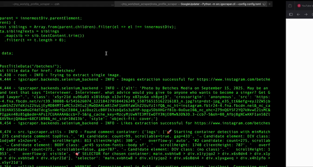

# Instagram Profile Scraper

A maintainable Python project for collecting public Instagram profile data.

## Short Byte


For the **full demo video**, click the thumbnail below:

[](https://github.com/shang-vikas/insta_profile_scraper/releases/download/v1.0.0/demo_ig_Scraper_final_720p_fast_mp4.mp4)


## Quick Start
This guide will walk you through setting up and running the Instagram Profile Scraper.

### 1. Prerequisites
- Python 3.11 or newer.
- Google Chrome browser installed.

### 2. Installation

First, clone the repository and set up a virtual environment.
```bash
# Clone the repository
git clone https://github.com/shang-vikas/insta_profile_scraper.git
cd insta_profile_scraper

# Create and activate a virtual environment
python3.11 -m venv venv
source venv/bin/activate

# Install the required dependencies
python3.11 -m pip install -r requirements.txt
```

### 3. Authentication (Cookie Generation)
The scraper logs in using browser cookies to appear like a real user. You need to generate a cookie file first.

1.  Run the `login_Save_cookie.py` script:
    ```bash
    python3.11 src/igscraper/login_Save_cookie.py
    ```
2.  A Chrome browser window will open to the Instagram login page. **Log in to your Instagram account manually.**
3.  After you have successfully logged in, go back to your terminal and **press Enter**.
4.  A cookie file named `cookies_xxxxxxxxxx.pkl` will be saved in the project's root directory. **Copy the full name of this file** for the next step.

### 4. Configuration

Before running the main scraper, you must configure it. A `sample_config.toml` is provided as a template.

1.  It's recommended to copy `sample_config.toml` to a new file, for example `config.toml`.
2.  Open your `config.toml` file and edit the following fields:
    -   `target_profile`: The Instagram username you want to scrape (e.g., `"ladbible"`).
    -   `num_posts`: The maximum number of posts you want to collect URLs for.
    -   `cookie_file`: The full path to the `.pkl` cookie file you generated in the previous step (e.g., `"cookies_1678886400.pkl"`).

### 5. Run the Scraper

Now you are ready to start scraping. Run the command below, pointing to your configuration file.
```bash
python3.11 -m src.igscraper.cli --config config.toml
```
The scraper will start, open the target profile, collect post URLs, and then scrape each post one by one, saving the data as it goes.

### 6. Understanding the Output

The scraper will create an `outputs/` directory (or as configured in your `.toml` file) containing the results inside a folder named after the `target_profile`:

-   **`posts_{target_profile}.txt`**: A simple text file containing the list of all post URLs collected from the profile page. This is used for caching so the scraper doesn't have to collect URLs on every run.
-   **`skipped_{target_profile}.txt`**: A log of posts that were skipped due to errors, saved in JSONL format.
-   **`metadata_{target_profile}.jsonl`**: This is the main data file. Each line is a complete JSON object representing a single scraped post. The structure of each JSON object is as follows:
    -   `post_url`: The direct URL to the Instagram post.
    -   `post_id`: An internal identifier for the post used during the scrape (e.g., "post_0").
    -   `post_title`: An object containing data from the post's header:
        -   `aHref`: The profile slug of the post's author (e.g., `/betches/`).
        -   `siblingTexts`: An array of strings containing the post's caption.
        -   `timeDatetime`: The timestamp of the post in ISO 8601 format.
    -   `post_images`: An object (for single-image posts) or a list of objects (for carousels) with image details:
        -   `src`: The direct URL to the image file.
        -   `alt`: The alt-text for the image, which often contains an AI-generated description.
    -   `likes`: An object containing the like count:
        -   `likesNumber`: The parsed number of likes (integer).
        -   `likesText`: The raw text for the likes (e.g., "9,589 likes").
    -   `post_comments_gif`: A list of objects, where each object is a scraped comment:
        -   `handle`: The username of the commenter.
        -   `date`: The relative timestamp of the comment (e.g., "8 h").
        -   `comment`: The text content of the comment.
        -   `likes`: The raw text for the comment's likes (e.g., "18 likes").
        -   `commentImgs`: A list of URLs for any GIFs or images included in the comment.

## Additional Notes

### Chromedriver installation(Incase selenium doesnt install it automatically)

#### **1. Install Google Chrome**

* You need the actual **Google Chrome browser** installed.
* Check Chrome version:

  * Open Chrome → `chrome://settings/help`
  * Example: **Chrome 117.0.5938.150**


#### **2. Install ChromeDriver**

Here’s the fork in the road:

##### **Option A: Selenium 4.6+ (recommended, easiest)**

Selenium now ships with **Selenium Manager**, which auto-installs ChromeDriver.
👉 You don’t need to manually download anything. Just run your script and it will handle the driver.

Example script:

```python
from selenium import webdriver

driver = webdriver.Chrome()
driver.get("https://www.google.com")
print(driver.title)
driver.quit()
```

If Chrome is installed, this will work out of the box.


##### **Option B: Manual ChromeDriver install (if Selenium Manager fails)**

1. Find your Chrome version (step 3).
2. Download the matching ChromeDriver from:
   👉 [https://googlechromelabs.github.io/chrome-for-testing/](https://googlechromelabs.github.io/chrome-for-testing/)
3. Extract it, put the binary somewhere in your **PATH** (e.g., `/usr/local/bin` on Linux/macOS, or `C:\Windows\System32` on Windows).
4. Verify:

   ```bash
   chromedriver --version
   ```

   Should print the version number.
---

## Legal Notice

This project is for educational purposes only. Please:
- Respect Instagram's Terms of Service
- Only scrape publicly available data
- Respect rate limits and add delays between requests
- Do not store or distribute copyrighted content without permission